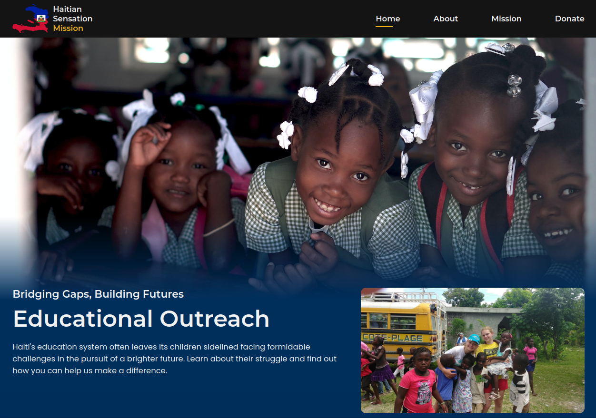

# Haitian Sensation Mission

## Description

Haitian Sensation Mission is a website dedicated to the cause of supporting and uplifting the lives of the Haitian community. Proceeds from the platform go towards various charitable works in Haiti, aiming to make a profound difference in the lives of many. This project leverages the power of SASS for stylish and responsive design and vanilla JavaScript for interactive functionalities.

## Features

- **Donation Collection**: Seamlessly collect donations through the integrated Zeffy platform.
- **Interactive UI**: Engaging user interface to guide donors and provide them with insights about the mission.
- **Responsive Design**: Optimized for various devices, ensuring a consistent user experience.

## Action Items (post-foundation work)

Owner tasks that could not be completed inside the foundation branch — roughly in priority order. See `audit-report.md` for full context and `content-manifest.md` for the content pipeline.

1. **Configure Zeffy success redirect → `/thank-you`** (Zeffy dashboard). Point the donation form's post-payment redirect at `https://haitiansensationmission.org/thank-you`. This is a hard blocker for Google Ad Grant conversion tracking; if Zeffy can't redirect, flag it before the grant application.
2. **Add GA4 + GDPR-compliant cookie consent** (owner decision to do post-operation). Fire a `donation_complete` conversion event on the `/thank-you` pageview. A comment marks the spot in `thank-you/index.html`.
3. **Verify Zeffy modal accessibility on the live site**: tab through the entire donate flow keyboard-only; check the injected iframe has a `title`; raise with Zeffy support if not.
4. **Run the image pipeline where npm works**: `npm i -D sharp && npm run images:optimize -- --resize && npm run images:dimensions` (remote sandbox couldn't install sharp). Or wait for the Cloudflare migration and enable Polish.
5. **Cloudflare Pages migration** (planned post-operation): build command `npm run build`, output dir `.`; `_redirects` works unchanged; then enable Polish (Lossy WebP), Brotli, and immutable cache headers on `/dist/*`.
6. **Content drop**: replace placeholders per `content-manifest.md`, flip those pages to `index, follow`, add them to `sitemap.xml`, then gate deploys with `STRICT=1 npm run guard:placeholders`.
7. **Pre-launch validation** (needs open network): W3C validator, axe-core/Pa11y, Lighthouse/PSI (target mobile ≥ 85), external-link checker.
8. ~~Design decisions on 3 contrast failures~~ — resolved by the Civic rebuild (2026-08-30): the failing components no longer exist; the Civic palette passes AA per design-spec §01.
9. ~~Verify the child-sponsorship claim~~ — resolved by brief v2: no matched-child sponsorship exists; the site now uses the "sponsor the classroom" frame throughout.
10. **Self-host the Civic fonts before launch** (design spec requirement): download Libre Franklin (400/600/700/900) and Source Sans 3 (400/600/700) as latin-subset woff2, place in `/dist/assets/fonts/`, add `@font-face` rules with `font-display: swap`, preload the two critical weights, and remove the Google Fonts `<link>` from every page head. (This sandbox cannot download files — Google Fonts links are the documented interim.)
11. **Contact form**: the design spec includes a form component; a static site needs a form backend (Netlify Forms is the natural fit while hosted there). Owner decision — until then `/contact` lists direct contact details.
12. **Verify design-mockup statistics** marked `CONTENT:VERIFY` (see the registry in `content-manifest.md`): education stats, meal-cost benchmarks, tier amounts beyond $5, founder quote, and hero-image stand-in selections.
13. **Optional cleanup**: 48 unreferenced images (~13 MB, incl. the 16000px `topsphere-media-MEGAHD.jpg`) listed in `audit-data/image-tables.md` can be deleted or archived.

## Acknowledgments

- Joseph Altenor, for the inspiration behind this mission.
- All the donors and supporters of the Haitian Sensation Mission.

## Commit Log

### 10/16/23

- FEAT(main): Alter organization name from LLC to Inc. & update legal pages with centered layout.

### 10/10/23

- FEAT(main): Update footer email address

- FEAT(about): Incorporate changes to our story including sweet sensations

- FEAT(seo): Rewrite meta descriptions and create OpenGraph tags on all pages. Create robots.txt @ root

### 10/9/23

- FEAT(history): Rewrite history article and incorporate new images and links.

### 10/3/23

- FEAT(main): Create History section on index page.

- FEAT(partials): Separate related styles from article scss into created related scss partial

### 10/2/23

- FEAT(main): Update sitemap.

- FEAT(main): Configure favicon into index, donate, and article pages.

### 9/30/23

- FEAT(disasters): Compile 2010 earthquake article with images and text.

- FIX(main): Revise donate page routing issue with about link

### 9/25/23

- FEAT(water): Revise text/images and added blockquotes.

- FEAT(water): Compile clean water article with images and text.

- FEAT(main): Update Sitemap(dot)xml

### 9/24/23

- Project live @ haitiansensationmission(dot)org

### 9/23/23

- FEAT(education): Compile education article with text and images.

- FEAT(about): Compile our-story article with text and images.

### 9/22/23

- FEAT(history): Complete first history article draft and integrate link-to-donate.

### 9/21/23

- FEAT(temparticle): Complete responsive layout for template article.

- FEAT(home): Reselect home images and mobile responsive format.

### 9/20/23

- FEAT(zeffy): Continue progress on responsive layout structure for donate dot html

- FEAT(zeffy): Initiate build out on donate dot html from template article.

- FEAT(footer): Build footer onto article template and ensure proper document linkage.

- FEAT(mission): Refit and style mission cards for responsive purposes.

### 9/19/23

- FEAT(donate): Reframe join section responsive layout

- FEAT(donate): Reframe donate img/data responsive layout

- FIX(main): Resolve footer container margin issue so that no ScrollX exists on html document

- FEAT(articles): Adjust temp article structure and footer responsive design

### 9/18/23

- FEAT(articles): Adjust related article responsive behavior and enhance header logo with img.

### 9/17/23

- FEAT(footer): Update footer and integrate legal/terms and legal/privacy documents

### 9/15/23

- FEAT(articles): Build out articles template and integrated related articles section.

### 9/14/23

- FEAT(articles): Create articles directory, article template, and, article partial and instituted principal styling.

### 9/13/23

- REFACTOR(partials): Refactors main.SCSS into partials and added bak file.

- FEAT(media): Integrate initial media queries for large screens.

- FEAT(media): Integrate initial media queries for small and medium devices

- FEAT(headernav): Add nav__menu active link functionality with javascript.

- FEAT(headernav): Integrate scrollUp link and showScroll with javascript functionality.

- FEAT(donate): Create/style donate section.

### 9/12/23

- FEAT(footer): Create/style footer section

- FEAT(mission): Create/style mission section and add mission trip photos to assets/images

- FEAT(about): Create/style about section and add mission.md

- FEAT(headernav): Add blur-header after Y Scroll

### 9/11/23

- FIX(main): Readjust home background img position and nav toggle size

- FEAT(home): Create and style home section

- FEAT(headernav): Create and style headernav and integrate Hide/Show functionality

- Project Restructure

### 5/19/23

- Init Commit
